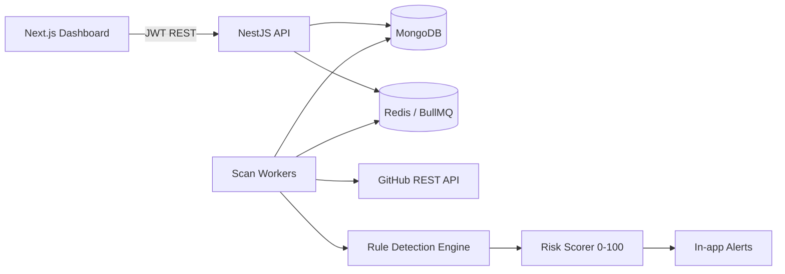

# GitHub OSINT Threat Intelligence Platform

## What is this, in plain English?

Imagine your company's brand — your login pages, your app, your name — showing up on GitHub in places it shouldn't. Someone cloning your login page to phish your customers. A fake version of your Android app bundled with malware. A developer accidentally uploading a file full of real passwords and API keys to a public repository.

This happens more often than you'd think, and nobody is watching for it by default. GitHub has millions of public repositories, and there's no alarm bell that rings when one of them starts impersonating your brand or leaking your secrets.

This platform is that alarm bell. You tell it which companies/brands to watch and which suspicious words to look out for (things like "login", "otp", "apk", "wallet", "secret"), and it searches public GitHub for repositories that combine your brand name with those red flags. When it finds something, it doesn't just hand you a list of links — it opens the repository, reads the code and files, and checks for real evidence: leaked AWS keys, exposed database passwords, phishing-style HTML, fake app packages, and more. Every match gets a **risk score from 0 to 100**, so you know instantly whether it's a "worth a look someday" or a "drop everything, this is bad."

> **Important:** this tool only ever *looks* at public GitHub data. It never runs, installs, or executes anything from a scanned repository — it just reads text and reports what it sees. Secrets are masked automatically before they're ever stored or displayed, so the tool never becomes a leak itself.

## What it actually does today

- **Watch your companies/brands** — add, edit, enable/disable them from the dashboard. No developer needed to add a new brand to monitor.
- **Manage your own search keywords** — the words that make a match suspicious (login, wallet, phishing, secret, apk...) are fully editable from the UI, each with a category and priority. The system also auto-promotes new keywords on its own when a confirmed high-severity finding shows a pattern worth watching for.
- **Run scans on demand** — start a scan for one specific brand, a raw custom GitHub query, or everything at once, and cap how many repositories it should check. Scans run in the background and can be cancelled or retried. Discovery and content analysis can also be split into two deliberate steps: discover-only (save candidates cheaply, analyze nothing yet), then **Analyze discovered repos** to run real content analysis on that backlog, or **Re-analyze existing repos** to re-run detection on repos that were already analyzed — useful after adding a new keyword to a brand, so the updated keyword list gets checked against repos that were scanned before it existed.
- **Run keyword scans on a schedule, unattended** — the sequential scheduler runs one keyword at a time, each for its own configured duration, then automatically pauses that keyword (turning its own toggle off) before handing off to the next — so a queue of keywords works through itself over hours without babysitting, and a finished keyword doesn't just loop forever eating quota. A "View keywords to start" preview shows exactly which keywords the next click will run before you commit, and "Start all keywords" is available separately for deliberately force-resuming everything at once.
- **Search GitHub yourself** — a built-in search page lets anyone run an ad-hoc GitHub search, either by typing a query directly or by picking keywords from a list and clicking "Apply" to have a valid query built automatically — no need to learn GitHub's search syntax. Repos your workspace has already reviewed are hidden from new results by default (toggle "Include already-reviewed repos" to see them again), and repository search can be narrowed to a specific creation-date window.
- **Show real evidence, safely** — every finding shows exactly what was found and where (file, line, matched text), so nobody has to just trust a score.
- **Detect live deployments** — during deep analysis, the platform checks whether a repo has an actual live deployment (GitHub Deployments API, preferring the repo's own public `homepage` field over an auto-generated per-deployment URL, since those are frequently gated behind the hosting provider's own SSO wall) — so a finding that's just source code can be told apart from one that's an actively-running phishing site.
- **Track contributors across repos** — a dedicated Contributors page rolls up every contributor across every discovered repository, how many repos each one touches, and which companies those repos belong to — surfacing the same operator behind several different clone repos.
- **Classify findings your own way** — beyond the open/acknowledged/resolved/false-positive triage status, each finding can independently be tagged **Watchlist** (yellow), **Ignorelist** (grey), **Allowlist** (green), or **Blocklist** (red) — filterable, and the whole row is tinted its tag's color so a classified finding is recognizable at a glance while scanning a long list.
- **See what changed recently** — a Recent Activity feed lists repos pushed to on GitHub recently and findings that are new or came back from resolved, so you can tell what's actually moving without re-reading the whole findings list.
- **Alert on the important stuff** — critical and high-risk findings automatically raise an in-app alert so nothing serious gets buried in a long list.
- **Keep teams separate** — more than one team/company can use this at once. Each team ("workspace") only ever sees its own brands, keywords, scans, and findings — never anyone else's.
- **Bring your own GitHub access** — each team can plug in its own GitHub access token (encrypted, never readable again by anyone — not even by looking directly at the database) instead of sharing one token with every other team on the platform.
- **Show live progress** — while a scan runs, you watch it move through its stages in real time instead of refreshing a page and hoping.

---

## Architecture

### Simplified overview



### Actual architecture

The diagram above collapses a few things for a quick read. This is what's really deployed: five
independent BullMQ workers (not one generic "Scan Workers" box), the API and workers running as
one Render service rather than two separate ones, the specific managed providers in use, and the
live-progress loop that streams a running scan's status back to the browser over SSE.


| Layer | Stack |
|-------|--------|
| Frontend | Next.js 15, React, TypeScript, Tailwind CSS |
| Backend | NestJS 11, Mongoose, JWT, Swagger, BullMQ |
| Database | MongoDB (local Docker or Atlas) |
| Queue | Redis + BullMQ (async scan workers) |

Monorepo layout:

```
apps/api   NestJS backend (/api/v1)
apps/web   Next.js dashboard
```

## Quick start (local)

### Prerequisites

- Node.js 20+
- npm 10+
- MongoDB (Docker recommended) **or** a MongoDB Atlas connection string
- Optional: a GitHub personal access token (public read) for live scans

### 1. Install dependencies

```bash
cd /path/to/assignment
npm install
```

### 2. Start MongoDB + Redis

```bash
docker compose up -d mongo redis
```

This starts MongoDB on `localhost:27017` and Redis on `localhost:6379`. Safe and reversible: `docker compose down` stops them; add `-v` only if you intentionally want to wipe local volumes. `docker compose stop` / `docker compose start` pause and resume without losing data.

Prefer MongoDB Atlas instead of local Docker? Create a free cluster, allow your IP, and paste the connection string into `apps/api/.env` as `MONGODB_URI`.

### 3. Configure environment

```bash
cp .env.example apps/api/.env
cp .env.example apps/web/.env.local
```

Edit `apps/api/.env`:

```env
NODE_ENV=development
PORT=4000
MONGODB_URI=mongodb://localhost:27017/github-osint
JWT_SECRET=replace-with-a-long-random-string-at-least-32-chars
JWT_EXPIRES_IN=7d
CORS_ORIGIN=http://localhost:3000
GITHUB_TOKEN=          # optional shared token; workspaces can also bring their own
SCAN_MAX_REPOS=1000    # cap per scan; raise toward 5000 as quota allows
SEED_ON_BOOT=true
SEED_DEMO_EMAIL=        # required if SEED_ON_BOOT=true — your choice, never commit it
SEED_DEMO_PASSWORD=     # required if SEED_ON_BOOT=true — your choice, never commit it
TOKEN_ENCRYPTION_KEY=   # required only if workspaces will set their own GitHub token
REDIS_HOST=localhost
REDIS_PORT=6379
ENABLE_QUEUE_WORKERS=true
```

Edit `apps/web/.env.local`:

```env
NEXT_PUBLIC_API_URL=http://localhost:4000/api/v1
```

**Never commit real secrets.** `.env` files are gitignored — the demo credentials above and the encryption key are meant to live only in your local `.env`, never in source control.

### 4. Run it

```bash
# Terminal 1 — API (port 4000; workers run in-process when ENABLE_QUEUE_WORKERS=true)
npm run dev:api

# Terminal 2 — Web (port 3000)
npm run dev:web

# Optional production-style split (separate worker process):
# ENABLE_QUEUE_WORKERS=false npm run start:dev -w api
# npm run start:worker:dev -w api
```

- Dashboard: http://localhost:3000
- Swagger: http://localhost:4000/api/docs
- Health: http://localhost:4000/api/v1/health

### 5. Demo credentials (seeded local data only)

Seeding doesn't ship a hardcoded password — you choose it yourself via env vars, so nothing sensitive lives in the committed source. When `SEED_ON_BOOT=true` **and** both `SEED_DEMO_EMAIL` / `SEED_DEMO_PASSWORD` are set in your local `.env`, the API creates that user on boot (or after `npm run seed`). If either is missing, seeding is skipped with a warning — it never falls back to a built-in default.

Findings marked **DEMO** are synthetic and clearly labeled.

```bash
npm run seed   # seed manually instead of on boot
```

## Walking through the product, page by page

- **Dashboard** — at-a-glance view: findings by severity, recent critical hits, GitHub API quota health.
- **Scans** — start a scan scoped to one brand, a custom GitHub query, or everything; set a cap on how many repositories it should check; watch live progress; cancel or retry a scan; run the sequential keyword scheduler (queue keywords, each with its own duration, and let them work through themselves unattended). "Analyze discovered repos" and "Re-analyze existing repos" replay content analysis over the discovery backlog without a new GitHub search — the latter specifically for re-checking repos already analyzed once, after a brand's own keyword list changed.
- **Repositories** — every repository a keyword/GitHub search has discovered, analyzed or still pending, with filters for company, match location, language, status, and every relevant date; a "Branches" action clones and scans a specific non-default branch on demand (GitHub's search index only ever covers the default branch).
- **Recent Activity** — a dedicated feed of repos recently pushed to on GitHub and findings that are new or reopened, with a time-window and company filter, so recent movement doesn't require re-scanning the whole findings list.
- **Findings** — every match with full evidence: which repository, which file, which line, what was matched, the risk score and its breakdown, a triage status (acknowledged / resolved / false positive), an independent watchlist/ignorelist/allowlist/blocklist classification (color-coded, row-tinted, filterable), and — when detected — a live deployment link.
- **Contributors** — every contributor seen across every discovered repository, rolled up with how many repos each one touches and which companies those repos belong to, with company and minimum-repo-count filters.
- **Companies** (brands) — add, edit, enable/disable the companies/brands you want watched. Fully manageable from the UI, nothing hardcoded.
- **Keywords** — add, edit, enable/disable the suspicious words that combine with a brand name to trigger a match (category + priority per keyword).
- **Custom GitHub search** — run an ad-hoc GitHub search directly. Either type a raw GitHub query, or pick keywords from your list and click "Apply to query" to have a valid query built for you automatically.
- **Alerts** — a focused feed of just the Critical/High findings so the important stuff never gets lost in a long list.
- **Settings** — set or remove this team's own GitHub access token, so its scans don't compete with other teams for the same shared quota. Tokens are encrypted at rest and the raw value is never shown again, only a masked "last 4 characters" confirmation.

## Asynchronous scanning (BullMQ + Redis)

Scans don't run inside the HTTP request. `POST /api/v1/scans/manual` returns **202 Accepted** with a persisted scan ID (`status: queued`) and workers pick it up from there. Workers process jobs via Redis queues:

| Queue | Responsibility |
|-------|----------------|
| `scan-orchestrator` | Validate tenant, build queries, fan out searches |
| `github-search` | GitHub repo search (rate-limit aware) |
| `repository-analysis` | Safe metadata/README/small-file fetch |
| `detection-processing` | Rule engine + risk score persistence |
| `alert-dispatch` | Critical/High in-app alerts |
| `keyword-rotation` | Sequential scheduler's delayed "slot elapsed" handoff timer — see below |
| `branch-analysis` | On-demand clone + scan of one specific non-default branch |

A scan can optionally be scoped and capped:

```http
POST /api/v1/scans/manual
{ "mode": "incremental", "brandId": "…", "maxRepos": 200 }
```

or with a raw custom query instead of a brand:

```http
POST /api/v1/scans/manual
{ "customQuery": "kpmg filename:.env", "searchKind": "code", "maxRepos": 50 }
```

or narrowed to repos created in a specific window:

```http
POST /api/v1/scans/manual
{ "brandId": "…", "createdFrom": "2026-07-31", "createdTo": "2026-08-02" }
```

`maxRepos` is clamped server-side to the admin-configured ceiling (`SCAN_MAX_REPOS`) — a workspace can ask for fewer, never more. `createdFrom`/`createdTo` map to GitHub's `created:` search qualifier and only apply to repository search (rejected alongside `searchKind: "code"`, which doesn't support it). Every scan is started deliberately, on demand — there is no automatic background schedule.

### Worker tuning (env)

All 7 queues run as always-on workers, so their idle-maintenance chatter (stalled-job scans, empty-queue re-polling) is constant background Redis traffic independent of whether any scan is running — the dominant source of command volume on a metered/free Redis plan (e.g. Upstash's free tier). At BullMQ's defaults (30s stalled check, 5s idle re-poll) this alone costs roughly **3 million commands/month** from an app doing nothing, several times over a typical free-tier cap. Two env vars widen both:

```env
QUEUE_STALLED_INTERVAL_MS=300000   # how often each worker scans for stalled (crashed) jobs
QUEUE_DRAIN_DELAY_MS=120000        # how long a worker blocks before re-polling an empty queue
```

Neither setting delays a healthy scan: a worker's blocking wait unblocks the instant a job is actually pushed to it, regardless of how long its timeout is set to — `drainDelay` only governs how often it reissues that wait while the queue stays genuinely empty. `stalledInterval` only affects how fast a genuinely crashed worker's job is noticed and retried, which this app's traffic doesn't need to be fast. At these values idle chatter drops to roughly 150K commands/month.

Scan statuses: `queued`, `running`, `completed`, `partially_completed`, `failed`, `cancelled`.

Also available: `POST /scans/:id/cancel`, `POST /scans/:id/retry` (retry uses `failed_only` mode).

### Sequential keyword scheduler

A workspace-wide, ordered queue of `(company, keyword, duration)` slots that runs **exactly one keyword at a time**, each getting the workspace's whole GitHub token quota for its own duration instead of splitting it across everything running concurrently, then hands off to the next queued keyword. The queue can mix keywords from several different companies.

When a keyword's slot duration elapses, that keyword is **paused** (its own toggle turns off) before the handoff to the next slot — a duration is a one-shot "run for this long, then stop," not an invitation to keep re-running the same keyword forever every time the rotation laps back around. Resuming it later (the same per-keyword toggle) starts another timed run. Once every queued keyword ends up paused, the whole scheduler disables itself rather than spinning with nothing left to do.

- **Start the scan** — starts every already-*unpaused* configured keyword plus anything just added, previewable first via "View keywords to start" so you know exactly what's about to run before committing.
- **Start all keywords** — force-resumes the *entire* queue, paused or not, in one action.
- Per-keyword controls: pause/resume individually without touching the rest of the queue, choose which GitHub search kind(s) that keyword's turn runs (repo search / code search / both), and choose whether it resumes its own discovery pagination cursor or restarts every query at page 1 each turn.
- If a keyword's scan is still waiting out a GitHub rate-limit pause when its slot would otherwise end, the scheduler extends that slot (bounded: a few extensions, capped duration each) instead of cutting it off having made zero progress — but a persistently-blocked keyword still eventually hands off rather than monopolizing the whole queue.

Endpoints: `GET/POST /scans/keyword-rotation`, `/keyword-rotation/start`, `/stop`, `/add` (append to an already-running queue without touching the current turn), `/pause`, `/resume`, `/remove`, `/search-scope`, `/continue-discovery`.

### Incremental, checkpointed scanning

Scans are **incremental by default**. Identity is always the GitHub repository **numeric ID** (names/renames are display-only).

Each repository tracks: `githubId`, `updated_at` / `pushed_at`, default branch, last processed commit SHA, last successful scan time, last ruleset version, and content ETag when available.

| Mode | Behaviour |
|------|-----------|
| `incremental` (default) | Skip content analysis when SHA + ruleset match a prior success |
| `full` | Force content analysis for every discovered repo |
| `failed_only` | Only re-analyze repos with `lastProcessingFailed` |
| `analyze_pending` | Skip search entirely; run real content analysis on every repo a prior discover-only scan found but never analyzed. Workspace-wide by default, or narrowed with `brandId` / `discoveredFrom` / `discoveredTo` / `maxRepos` |
| `reanalyze_existing` | Skip search entirely; force-re-analyze repos that were **already** analyzed, against the brand's *current* keyword list — for when a keyword is added after those repos were last checked. Same optional `brandId` / `discoveredFrom` / `discoveredTo` / `maxRepos` scoping as `analyze_pending`; always bypasses the incremental "unchanged, skip" decision, since the point is re-checking content against new keywords, not against new code |

Rescan also happens when: content SHA changed, ruleset version changed, previous processing failed, no successful scan exists, or the client sets `forceFullScan: true`.

The commit SHA behind that decision comes from `git ls-remote` (git's own transport) for any repo eligible for clone-based scanning — not a GitHub REST call. GitHub's REST equivalent (`getRepositoryHead`) is actually *two* REST calls (repo metadata, then the branch ref), each carrying its own Redis rate-limit bookkeeping; for a clone-eligible repo, none of that happens anymore. Falls back to the REST check for anything not clone-eligible, or if `git ls-remote` itself fails.

Checkpoints after each stage store search pagination cursors and completed/skipped/failed github IDs so interrupted jobs resume without redoing finished work. Finding upserts are fingerprint-keyed (`githubId` + rules) so resume/retry does not create duplicates; lifecycle is recorded as `new` / `unchanged` / `reopened` / `resolved`.

#### Before / after metrics (content analysis)

Illustrative 20-repo workspace where 3 repos changed since the last successful scan (same ruleset):

| Metric | Before (always full) | After (incremental) |
|--------|----------------------|---------------------|
| Content analyses | 20 | 3 |
| Skipped (unchanged) | 0 | 17 |
| Rescanned | 20 | 3 |
| Content-fetch savings | — | ~85% |

HEAD SHA / metadata checks still run for accurate skip decisions; heavy README/file fetches are what get skipped.

### Real-time progress (SSE)

`GET /api/v1/scans/:id/events` streams authenticated progress events (JWT + `X-Workspace-Id`). Workers publish via Redis Pub/Sub so multiple API instances can fan out. Latest progress is persisted on the scan document for refresh/reconnect (`afterSeq` sequencing). If the browser's live stream can't connect, the dashboard quietly falls back to polling the same progress instead — you never lose visibility into a running scan.

Polling fallback: `GET /api/v1/scans/:id/progress?afterSeq=N`.

## GitHub rate-limit management

All GitHub traffic goes through a single managed client (`GitHubHttpClient`). No worker or service may call `api.github.com` directly.

| Concern | Behaviour |
|---------|-----------|
| Primary quota | Tracks `X-RateLimit-*` headers (limit, remaining, used, reset, resource) in Redis |
| Secondary / abuse | Honours `Retry-After`; pauses shared workers |
| Retries | Bounded exponential backoff + jitter; never retries 401/403 permission/422 validation |
| Low quota | When remaining ≤ `GITHUB_RATE_LIMIT_PAUSE_AT`, jobs pause and auto-resume after reset |
| Fairness | Per-workspace daily budget + concurrency; global concurrency cap |
| Per-workspace tokens | A workspace using its own GitHub token gets fully separate quota tracking — its usage never competes with, or is blocked by, the shared token's state |
| Conditional GETs | ETag / `If-None-Match` for content endpoints |
| Search dedup | Identical search calls (same path + params) within `GITHUB_SEARCH_DEDUP_CACHE_MS` (default 3 min) are answered from memory — no GitHub call, no Redis bookkeeping. Search is the strictest quota (30/min vs core's 5,000/hr) and the one thing clone-scan can't route around, so overlapping keywords across brands or a resumed scan re-issuing a page don't each cost a fresh call. Shared across every workspace since results are public GitHub data |
| Observability | Structured logs (no tokens) + counters; `GET /api/v1/github/rate-limit` |
| Redis command volume | Every call re-checks pause/quota state in Redis before proceeding; these reads are cached in-process for `GITHUB_RATE_LIMIT_CACHE_MS` (default 1s) so a burst of calls collapses into one Redis round trip instead of one per call. Writes are batched the same way: request-count metrics accumulate in memory and flush periodically instead of one write per call, and rate-limit snapshot writes are throttled to the same interval — except when remaining quota nears the pause threshold, which always flushes immediately so pause detection is never delayed |

The **GitHub API quota** panel on the dashboard shows this live: `CORE` is GitHub's general REST quota (repo/content fetches, 5,000/hr for an authenticated token), `SEARCH` is the separate, stricter quota for `/search/*` calls, `WORKSPACE BUDGET` only applies to workspaces still on the shared token (a fairness cap so one team can't starve another's share of the *shared* token), and `PAUSED SCANS` shows how many scans are currently waiting out a rate-limit pause.

### Administrator thresholds (env)

```env
GITHUB_RATE_LIMIT_LOW=20              # dashboard warning
GITHUB_RATE_LIMIT_PAUSE_AT=5          # pause workers
GITHUB_WORKSPACE_DAILY_BUDGET=5000    # per-tenant daily requests (shared-token workspaces only)
GITHUB_WORKSPACE_MAX_CONCURRENCY=2    # per-tenant in-flight
GITHUB_GLOBAL_MAX_CONCURRENCY=10      # across all tenants
GITHUB_RETRY_ATTEMPTS=3
GITHUB_MAX_INLINE_WAIT_MS=15000       # wait inline; longer waits delay BullMQ jobs
```

## Per-workspace GitHub tokens (Settings page)

Any workspace can set its own GitHub personal access token from the Settings page instead of relying on the shared instance-level token. The security model:

- Tokens are encrypted at rest with **AES-256-GCM** before being written to the database — the raw token is never stored in plaintext.
- The encryption key (`TOKEN_ENCRYPTION_KEY`) lives only in server environment variables, never in the database itself — so even someone with direct, full read access to the database cannot decrypt a stored token without also having the server's environment secret.
- The API only ever returns a masked status (`configured: true/false`, last 4 characters) — the full token is never sent back to the browser after it's set, not even to the person who set it.
- Setting a token immediately verifies it against GitHub's `/rate_limit` endpoint (which doesn't cost any quota to call) and populates that workspace's quota snapshot right away — so the dashboard's quota panel has real data before the first scan runs, and a bad token is rejected on the spot instead of failing silently mid-scan later. If GitHub rejects it outright, the token is not saved.

## Multi-tenancy

Tenant-scoped resources (brands, keywords, findings, scans, alerts, repositories) require the `X-Workspace-Id` header. Membership is verified on every request — the header alone is never trusted.

Every workspace has exactly one member: its **owner**, who is whoever created it. New registrations automatically get their own personal workspace as its owner. There's no invite/member-management flow and no secondary role — a workspace is a private space for one account's brands, keywords, scans, and findings, fully isolated from every other workspace on the platform.

## Without a GitHub token

The API boots and the dashboard works without `GITHUB_TOKEN`. Queued scans complete with a message that live GitHub calls were skipped. Add a classic PAT with minimal public read access (either the shared env var or a per-workspace token in Settings) to enable live searches.

## API overview

All routes are prefixed with `/api/v1` and documented in Swagger.

| Method | Path | Auth | Description |
|--------|------|------|-------------|
| POST | `/auth/register` | No | Register (creates a personal workspace as owner) |
| POST | `/auth/login` | No | Login |
| GET | `/auth/me` | Yes | Current user |
| GET | `/dashboard/summary` | Yes | Overview stats |
| GET | `/findings` | Yes | Filtered findings (incl. `status`, `listStatus`) |
| GET | `/findings/:id` | Yes | Finding detail |
| PATCH | `/findings/:id/status` | Yes | Triage status + note |
| PATCH | `/findings/:id/list-status` | Yes | Watchlist / ignorelist / allowlist / blocklist tag — independent of triage status |
| GET | `/scans` | Yes | Scan history |
| POST | `/scans/manual` | Yes | Enqueue a scan (202); body `{ mode?, forceFullScan?, brandId?, customQuery?, searchKind?, maxRepos?, createdFrom?, createdTo?, discoveredFrom?, discoveredTo? }` |
| GET | `/scans/search` | Yes | Ad-hoc GitHub repo/code search through the managed client; query params `q, page, type, createdFrom?, createdTo?, includeSeen?` |
| GET | `/scans/:id` | Yes | Scan job detail |
| GET | `/scans/:id/progress` | Yes | Poll latest progress |
| GET | `/scans/:id/events` | Yes | SSE progress stream |
| POST | `/scans/:id/cancel` | Yes | Cancel queued/running scan |
| POST | `/scans/:id/retry` | Yes | Retry failed/partial scan (202) |
| GET | `/scans/pending-analysis-count` | Yes | Live count for "Analyze discovered repos" (`mode=analyze_pending`); same optional `brandId`/`discoveredFrom`/`discoveredTo` scoping |
| GET | `/scans/analyzed-count` | Yes | Live count for "Re-analyze existing repos" (`mode=reanalyze_existing`) |
| GET | `/scans/repositories/recent-changes` | Yes | Repos recently pushed to on GitHub + findings that are new/reopened; `days`, `limit`, `brandId` |
| GET/POST | `/scans/keyword-rotation`, `/keyword-rotation/start`, `/stop`, `/add`, `/pause`, `/resume`, `/remove`, `/search-scope`, `/continue-discovery` | Yes | Sequential keyword scheduler — see above |
| GET | `/contributors` | Yes | Cross-repo contributor rollup; `search`, `companyId`, `minRepositories`, `sortBy`, pagination |
| GET | `/brands` (alias: `/companies`) | Yes | Monitored companies/brands |
| POST | `/brands` | Yes | Add a company/brand |
| PATCH | `/brands/:id` | Yes | Edit / enable / disable a brand |
| DELETE | `/brands/:id` | Yes | Remove a brand |
| GET | `/keywords` | Yes | Monitored keywords |
| POST | `/keywords` | Yes | Add a keyword |
| PATCH | `/keywords/:id` | Yes | Edit / enable / disable a keyword |
| DELETE | `/keywords/:id` | Yes | Remove a keyword |
| GET | `/alerts` | Yes | In-app alerts |
| PATCH | `/alerts/:id/read` | Yes | Mark alert read |
| GET | `/github/rate-limit` | Yes | GitHub quota / budget / pause status |
| GET | `/workspaces` | Yes | List workspaces you belong to |
| POST | `/workspaces` | Yes | Create a workspace (you become its owner) |
| GET | `/workspaces/:id` | Yes | Get a workspace if you're a member |
| POST | `/workspaces/:id/switch` | Yes | Validate membership and return workspace context (powers the workspace switcher) |
| GET/PATCH/DELETE | `/workspaces/:id/github-token` | Yes | Manage this workspace's own GitHub token |
| GET | `/health` | No | Health check |
| GET | `/` | No | Friendly pointer (dashboard URL, docs, health) — not under `/api/v1`, excluded from Swagger |

## Detection & risk scoring

Modular rules live under `apps/api/src/detection/rules/` and are independent of the GitHub client:

- Exposed secrets (AWS, GitHub PAT, MongoDB/Postgres/MySQL URIs, Firebase, Stripe, Slack, OpenAI, Anthropic, Discord, Twilio, SendGrid, JWT, SSH, generic tokens + high-entropy assignments)
- Brand impersonation
- Phishing indicators
- Fake APK / Android
- Malware indicators
- Obfuscated commands
- Low-reputation / newly created brand repos

Discovery is multi-channel (not keyword-only): query families (apk / phishing / impersonation), typo-squat name checks, brand-agnostic filename/secret code search, then owner fan-out + fork walking from Critical/High hits. Repository analysis uses recursive git trees and prioritizes `.env` / credential paths.

**Clone-based scanning** (`ENABLE_CLONE_SCAN`, **on by default**) shallow-clones eligible repos over git's own transport instead of fetching files one-by-one through the REST API, and scans the full working tree locally (skipping `node_modules`, `dist`, `vendor`, and similar directories). Two independent wins: full-repo coverage instead of a bounded priority-file list, and it isn't subject to the REST rate limit *or* the Redis-backed rate-limit/concurrency bookkeeping every REST call goes through — which is what actually keeps a large scan (hundreds of repos) from burning through a metered Redis plan's monthly command budget. It fails closed: any problem (git unavailable, clone timeout, repo over `CLONE_SCAN_MAX_REPO_SIZE_KB`) just falls back to the REST-based fetch (`SCAN_MAX_FILES_PER_REPO`, default 12 files/repo) with no other change in behavior, so it's safe to leave on, and can be disabled with `ENABLE_CLONE_SCAN=false` at any time. The temp directory a clone is checked out into is always removed afterward, retrying past a transient Windows file-lock race instead of silently leaving orphaned checkouts on disk.

**Deployment detection and contributor tracking** run during deep analysis alongside detection: the GitHub Deployments API is checked for a live `environment_url`, preferring the repo's own public `homepage` field over the raw per-deployment URL when both exist (an auto-generated deployment URL for a team-owned project is frequently gated behind the hosting provider's own SSO/Deployment Protection, which a public `homepage` isn't); repository contributors are recorded and cross-referenced against every other repo in the workspace, so the same operator behind several differently-named clone repos becomes visible instead of looking like unrelated one-off incidents.

Two feedback mechanisms close the loop from what's actually found back into future scans:
- **Keyword auto-promotion** (`AUTO_PROMOTE_KEYWORDS`, on by default): a Critical/High finding checks the repo's name/description/topics against the curated keyword universe and auto-enables any matching term the workspace hasn't turned on yet, so future query generation organically expands from confirmed threats instead of only from queries picked in advance.
- **Git history scan** (`ENABLE_GIT_HISTORY_SCAN`, off by default — costs extra GitHub requests): for repos that already matched a monitored brand, scans recent commit diffs (not just current HEAD) for secrets that were committed and later deleted — a live-HEAD-only scan never sees those. Findings from history are tagged with a `history/<sha>/<path>` file so they're clearly distinguishable from live evidence.

Risk score **0–100** with stored breakdown:

| Band | Severity |
|------|----------|
| 85–100 | Critical |
| 65–84 | High |
| 40–64 | Medium |
| 0–39 | Low |

Critical and High findings create **in-app alerts**. Findings can be triaged (`open` / `acknowledged` / `false_positive` / `resolved`) with notes. `resolved` findings **reopen** automatically if the same fingerprint is seen again (it was a real issue that came back); `false_positive` findings do **not** — that's a human verdict that the pattern isn't a threat, and re-flagging it on every rescan would just be triage noise.

Independent of that workflow status, every finding can also carry a **watchlist / ignorelist / allowlist / blocklist** classification tag (`none` by default) — a separate axis answering "how do we feel about this going forward" rather than "where is this in triage." A finding can be `resolved` *and* `blocklist`ed at the same time; they track different questions and are filterable/settable independently on the Findings page.

## Scripts

```bash
npm run dev:api      # Nest watch mode
npm run dev:web      # Next.js dev server
npm run build        # Build api + web
npm run lint         # Lint both apps
npm run typecheck    # Typecheck both apps
npm run test         # Run tests
npm run seed         # Seed demo data (requires SEED_DEMO_EMAIL / SEED_DEMO_PASSWORD)
npm run migrate:workspaces   # One-off: backfill pre-existing users/records into workspaces
```

## Testing

```bash
npm run test:api
```

API unit tests cover authentication flows, multi-tenancy/membership enforcement, detection rules, risk scoring, secret redaction, per-workspace token encryption, GitHub rate-limit scoping, and fingerprint stability. GitHub calls are never required for tests.

## Security notes

- Helmet, CORS allowlist, global validation pipes, throttling
- Passwords hashed with bcrypt (12 rounds)
- JWT bearer auth on protected routes
- Per-workspace GitHub tokens encrypted at rest with AES-256-GCM; the decryption key never lives in the database, so a database leak alone can't expose a token
- Secret redaction utility used before persistence/logs/UI
- Outbound GitHub requests use a fixed `api.github.com` base URL with owner/repo/path validation (SSRF-aware)
- Conservative GitHub usage (`SCAN_MAX_REPOS`, small pages, pacing delays)
- No execution of repository content; only small text files (<50KB) are fetched
- Every tenant-scoped request re-verifies workspace membership server-side — a workspace ID in a request header is never trusted on its own

## Known limitations

- A workspace has exactly one member (its owner) by design — there's no invite/team flow, so it can't be shared with teammates today.
- Every scan still has to be started deliberately — there is no cron/external trigger. The sequential keyword scheduler runs unattended *after* it's started (working through a queued list of keywords over hours, each for its own duration), but starting it in the first place is still a manual action, and it only keeps running for as long as the API process itself stays up.

## Assignment PDF

See `GitHub_OSINT_Assignment.pdf` in the repo root.

## License

UNLICENSED — candidate assignment deliverable.
