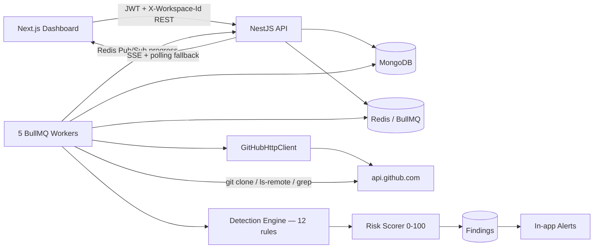

# GitHub OSINT Threat Intelligence Platform — Full Project Report

This document is a complete technical analysis of this repository: what it is, why every major
piece exists, exactly how data flows from a user clicking "start scan" to a finding appearing on
their screen, and what its real limitations are. It was produced by reading the actual source
under `apps/api/src` and `apps/web/src` (not just the README), so it also calls out places where
the code and the README diverge.

---

## Table of contents

1. [What this project is, and why](#1-what-this-project-is-and-why)
2. [High-level architecture](#2-high-level-architecture)
3. [The user journey, screen by screen](#3-the-user-journey-screen-by-screen)
4. [How a scan actually runs, end to end](#4-how-a-scan-actually-runs-end-to-end)
5. [How repositories are found (discovery)](#5-how-repositories-are-found-discovery)
6. [How content is fetched: clone-scan vs REST](#6-how-content-is-fetched-clone-scan-vs-rest)
7. [Incremental scanning — deciding what to skip](#7-incremental-scanning--deciding-what-to-skip)
8. [The detection engine — every rule, precisely](#8-the-detection-engine--every-rule-precisely)
9. [Risk scoring — how 0–100 is computed](#9-risk-scoring--how-0100-is-computed)
10. [Fingerprinting & operator attribution](#10-fingerprinting--operator-attribution)
11. [Credential live-verification & destination liveness](#11-credential-live-verification--destination-liveness)
12. [GitHub API client & rate-limit management](#12-github-api-client--rate-limit-management)
13. [Real-time scan progress (SSE)](#13-real-time-scan-progress-sse)
14. [Multi-tenancy & security model](#14-multi-tenancy--security-model)
15. [Data model (what's actually stored)](#15-data-model-whats-actually-stored)
16. [Environment configuration reference](#16-environment-configuration-reference)
17. [Testing](#17-testing)
18. [Known limitations](#18-known-limitations)
19. [Code-level findings: inconsistencies, dead code, sharp edges](#19-code-level-findings-inconsistencies-dead-code-sharp-edges)
20. [Glossary](#20-glossary)

---

## 1. What this project is, and why

This is a **GitHub OSINT (open-source intelligence) threat-intelligence platform**, built as a
candidate assignment (see `GitHub_OSINT_Assignment.pdf` in the repo root). The problem it solves:
GitHub hosts millions of public repositories, and nothing watches them for abuse of a specific
company's brand — a cloned login page used for phishing, a fake Android banking app bundled with
malware, a developer accidentally committing real AWS/database credentials. This platform is that
watch: an operator (a security team) tells it which brands to monitor and which red-flag keywords
matter, and it continuously (on-demand) searches GitHub, fetches matching repositories' content,
runs a rule-based detection engine over that content, and turns confirmed hits into scored,
evidence-backed findings and alerts.

It is explicitly **read-only OSINT**: it never executes, installs, or runs anything from a
scanned repository. It only reads text (README, source files, git history) and — for a small,
deliberately scoped set of credential types — makes a single read-only "who am I" call to the
credential's own provider to check if it's still live. Secrets are masked before they are ever
stored, logged, or displayed.

## 2. High-level architecture

Monorepo, npm workspaces:

```
apps/api   NestJS 11 backend  (REST API + 5 BullMQ queue workers)
apps/web   Next.js 15 frontend (App Router, React 19, Tailwind v4)
```

| Layer | Stack |
|---|---|
| Frontend | Next.js 15, React 19, TypeScript, Tailwind CSS v4, Recharts |
| Backend | NestJS 11, Mongoose (MongoDB), Passport-JWT, Swagger, BullMQ |
| Database | MongoDB |
| Queue / pub-sub | Redis + BullMQ |
| External data source | GitHub REST API (`api.github.com`) + `git` CLI (clone/grep/ls-remote) |

The API and the five queue workers can run **in one process** (`ENABLE_QUEUE_WORKERS=true`,
the default for local dev) or as **two separate processes** — `apps/api/src/main.ts` (HTTP API)
and `apps/api/src/worker.ts` / `worker.module.ts` (standalone worker process, same `AppModule`
graph minus the HTTP layer) — which is how it's meant to be split in a real deployment.



## 3. The user journey, screen by screen

**Landing (`/`)** — public, no API calls. Marketing copy, feature grid, severity-band legend, and
sign-in/register CTAs.

**Register (`/register`)** → `POST /auth/register` (creates the user, bcrypt-hashes the password
at 12 rounds, and auto-creates a personal workspace with that user as owner). The response
includes a JWT, but the frontend **discards it** and redirects to `/login?registered=1` — the
user must log in explicitly a second time (a deliberate, if slightly redundant, choice).

**Login (`/login`)** → `POST /auth/login` → JWT stored in `localStorage` (`accessToken`) and the
returned `defaultWorkspaceId` stored alongside it (`workspaceId`). There are **no cookies and no
refresh tokens anywhere** in this app — a pure localStorage-token SPA. Every subsequent page is
wrapped in a `RequireAuth` component that, on mount, calls `GET /auth/me` to confirm the stored
token is still valid server-side before rendering anything.

**Every protected API call** automatically carries two headers via the single `api()` wrapper in
`apps/web/src/lib/api.ts`: `Authorization: Bearer <jwt>` and `X-Workspace-Id: <workspaceId>` (the
latter is skipped only for auth/health/workspace-management routes). The backend's `TenantGuard`
re-verifies membership in that workspace on **every** tenant-scoped request — the header alone is
never trusted.

**Dashboard (`/dashboard`)** — one call, `GET /dashboard/summary`: stat cards (total/critical/
high findings, repos scanned), a live GitHub API quota panel, findings-by-severity and
findings-over-time charts (Recharts), and a recent-critical-findings feed.

**Companies / Brands (`/brands`)** — full CRUD over the entities being monitored: name,
description, `aliases` (name variants), `keywords` (this brand's own curated risk terms),
`trustedGithubOwners` (this brand's *own real* GitHub accounts/orgs, used for internal audits),
and an enabled toggle. Nothing is hardcoded — an operator adds every brand from this screen.
(`apps/api/src/common/enums.ts` does ship a `MONITORED_BRANDS` constant with 14 example
fintech/tech brands for seed data, but it is not a hard-coded allowlist — brands live entirely in
the `MonitoredBrand` Mongo collection, editable per workspace.)

**Keywords (`/keywords`)** — the brand-agnostic curated keyword universe (`category`: general /
phishing / malware / secret / brand, `priority` 1–10). These feed `buildQueryFamilies` (query
generation) and get **auto-promoted** by the system itself when a confirmed Critical/High finding
matches a term the workspace hasn't enabled yet.

**Scans (`/scans`, `/scans/[id]`)** — the operational core. A wizard lets an operator choose:
mode (`incremental`/`full`/`failed_only`), then a hard fork between **Internal Audit** (scan one
brand's own `trustedGithubOwners` for leaked secrets) and **External Scan** (hunt for
impersonators — scoped to `all` brands, one `brand`, or a raw custom `query`), plus `maxRepos`,
an optional `createdFrom`/`createdTo` window or "only today's repos" toggle, and a
"continue from last scan" (`continueDiscovery`) checkbox that resumes GitHub search pagination
from where the workspace's last scan of that exact query left off. Submitting calls
`POST /scans/manual` (**202 Accepted**, the scan runs entirely in the background) and hard-
navigates to the scan's detail page, which shows **live progress over SSE** (with an automatic
polling fallback if the SSE connection can't be established), cancel/retry actions, and per-query
resume-page annotations.

**Search (`/search`)** — an ad-hoc GitHub search console for analysts: type a raw GitHub query
directly, or pick curated keywords from a chip list and click "Apply to query" to have a valid
GitHub search query assembled automatically (no need to know GitHub's search syntax). Supports
repo-vs-code search, a creation-date window, and an "include already-reviewed repos" toggle that
by default hides repos this workspace has already looked at.

**Findings (`/findings`, `/findings/[id]`)** — the evidence record. Filterable by severity,
status, category, threat-class (credential exposure vs. malicious intent vs. other), origin
(internal vs. external), brand, and date range, plus a "Rule precision" panel showing each rule's
own false-positive rate computed from this workspace's actual triage history. The detail page
shows every triggered rule with its exact evidence (file, line number, matched/redacted text, a
deep-link to the GitHub blob line), a signed risk-score breakdown, brand-match evidence, linked
identities (see §10), and a manual "Verify credential" button per exposed-secret detection (see
§11). Triage: `open → acknowledged / resolved / false_positive`, with a note. `resolved` findings
**reopen automatically** if the same fingerprint reappears in a later scan; `false_positive`
verdicts never auto-reopen.

**Alerts (`/alerts`)** — a flat, capped, unpaginated feed of only the Critical/High findings that
were **newly created or reopened** (never a repeat alert for an unchanged finding), with a
per-item "mark read" action.

**Settings (`/settings`)** — per-workspace GitHub token management: set/replace/clear, displayed
only as "configured, ending in ••••1234" — the full value is never sent back to the browser after
being saved.

## 4. How a scan actually runs, end to end

`POST /scans/manual` is validated (`ManualScanDto`), clamps `maxRepos` to the admin ceiling
(`SCAN_MAX_REPOS`, default 1000 — a caller can ask for fewer, never more), computes a
`configHash` over `{workspace, brand(s), maxRepos, scope}` to detect and reject/replace a
duplicate already-running scan, then persists a `ScanJob` document (`status: queued`) and enqueues
**exactly one** BullMQ job onto the `scan-orchestrator` queue. The HTTP response returns
immediately (`202`) with the scan's id — nothing about the scan itself (search, fetch, detection)
ever runs inside the HTTP request.

From there, five independent BullMQ queues (each its own worker, its own concurrency) form a
pipeline:

```
scan-orchestrator → github-search → repository-analysis → detection-processing → alert-dispatch
```

1. **`scan-orchestrator`** — the entry point. Branches on scan shape (`failed_only` retry /
   `internalAudit` / custom query / brand sweep), builds the list of GitHub search queries (§5),
   resolves each query's resume page (from this scan's own checkpoint, or the workspace's durable
   cross-scan `DiscoveryCursor` if `continueDiscovery` was requested), and fans out one
   `github-search` job per query.
2. **`github-search`** — calls GitHub's repo/code search via the managed client (§12), claims
   each result once per scan (race-safe, capped at `maxRepos`), enqueues one `repository-analysis`
   job per newly-claimed repo, handles pagination (including two independent "split an oversized
   query" strategies — by language for code search, by bisecting the date range for repo search —
   triggered once `total_count` nears GitHub's 1000-result search cap), and writes both an
   in-scan checkpoint and a durable cross-scan cursor.
3. **`repository-analysis`** — resolves the repo's current HEAD commit (via `git ls-remote`
   for clone-eligible repos — zero REST calls — or two REST calls otherwise), asks the incremental
   engine (§7) whether content analysis is actually needed, and if so fetches content either via a
   full shallow git clone (§6) or the bounded REST fallback, then enqueues a
   `detection-processing` job with everything gathered.
4. **`detection-processing`** — runs the 12-rule detection engine (§8) plus reuse/fingerprint
   checks, scores the result (§9), upserts a `Finding` (dedup-keyed by `githubId` + sorted rule
   ids), triggers reactive discovery expansion and keyword auto-promotion for Critical/High hits
   (§5), and — if the finding is new/reopened **and** Critical/High — enqueues an `alert-dispatch`
   job.
5. **`alert-dispatch`** — creates (idempotently) an in-app `Alert` document for the finding.
   Alerting is currently **in-app only**; no email/Slack/webhook dispatch exists in this codebase
   despite the `channel: 'in_app'` field name implying multi-channel support.

Every state change along this pipeline calls into `ScanProgressService`, which persists the
latest progress directly on the `ScanJob` document (source of truth for reconnect) and publishes
it over Redis Pub/Sub for the SSE endpoint to fan out live (§13).

## 5. How repositories are found (discovery)

Discovery is **multi-channel**, not a single keyword search. For each enabled brand (or the one
scoped brand, or a raw custom query), `buildQueryFamilies`
(`apps/api/src/scans/discovery/query-families.ts`) constructs a deduplicated, capped
(`SCAN_MAX_QUERIES`, default 200) list of GitHub search queries across these families:

- **`phishing`** — brand term + `(login OR verification)` in name/description, using the
  workspace's own top-priority `phishing`-category keywords (fallback: `login`, `phishing`).
- **`apk`** — brand term + `(apk OR stealer)`, using top `malware`-category keywords.
- **`impersonation`** — brand term + `clone OR spoof OR fake OR unofficial`.
- **`typo-squat`** — up to 3 algorithmically generated misspellings of the brand term (leetspeak
  substitution, trailing-letter typo, dropped-middle-character, adjacent-character transposition,
  and 16 `{brand}-{login,apk,otp,verify,support,app,official,wallet}` intent-suffix combinations —
  see `discovery/typo-squat.ts`), each searched as `in:name`.
- **`brand-keyword-custom`** — every one of *this brand's own* curated keywords, each combined
  with the brand term as an exact phrase (up to 100 per brand).
- **`brand-secret`**, **`brand-keyword-custom-code`**, **`distinctive-content`** — code-search
  variants of the above, plus up to 5 "distinctive phrases" pulled from a brand's ingested
  reference repos (§10), searched verbatim as exact-phrase code search — catching a copy-pasted
  chunk of the brand's own real UI/legal text inside someone else's repo.
- **`trusted-account`** — an unconditional `org:` and `user:` sweep of every one of the brand's
  own `trustedGithubOwners` (this is also the entire mechanism internal-audit mode uses, just
  without going through search first — it lists the owner's repos directly).
- **`brand-keyword`** (brand-agnostic) and **`secret-filename`** — top curated `brand`-category
  keywords, and 9+ static filename-targeted code searches (`filename:.env AKIA`,
  `filename:credentials.json`, `filename:id_rsa`, `extension:pem BEGIN PRIVATE`, etc.) that don't
  need any brand match at all — pure secret-hunting across all of public GitHub.

**Reactive expansion**, on top of the query-driven search above: whenever a repo's detection
result comes back Critical or High severity, `DiscoveryExpansionService` (triggered from
`detection-processing`, not from every repo) does two things, each claimed once per scan to avoid
repeats:

- **Owner fan-out** — lists up to 5 more repos owned by the same GitHub account (a confirmed bad
  actor rarely stops at one repo).
- **Fork walking** — lists up to 5 forks of the confirmed-bad repo itself (clones of a phishing
  kit propagate as forks).

Every newly discovered candidate from either path is claimed and queued for analysis just like a
normal search hit, subject to the same `maxRepos` cap.

**Keyword auto-promotion** closes the loop the other direction: a confirmed Critical/High finding's
repo name/description/topics are checked against the full curated keyword universe, and up to 2
new matching keywords the workspace hasn't enabled yet are auto-enabled — so future scans'
`buildQueryFamilies` organically expands from what was actually found, not just what was picked in
advance.

## 6. How content is fetched: clone-scan vs REST

Once a repo is selected for analysis, there are two fetch strategies:

**Clone-based scanning** (`ENABLE_CLONE_SCAN`, on by default) — a full shallow clone
(`git clone --depth 1 --single-branch --no-tags`) into a temp directory, subject to a size guard
(`CLONE_SCAN_MAX_REPO_SIZE_KB`, default 50 MB) and a hard timeout (`CLONE_SCAN_TIMEOUT_MS`,
default 30s, SIGKILL on expiry). Standard build/dependency directories are excluded
(`node_modules`, `.git`, `vendor`, `dist`, `build`, `.next`, `venv`, `__pycache__`, etc.). This
unlocks two things a REST-based fetch structurally cannot do:

- **Full-repo `git grep`** for brand mentions, curated keywords, and secret-pattern anchors —
  across every file in the tree, not just a capped sample. Grep hits are only *candidates*; the
  real regex is re-applied against each hit line before anything is reported as a finding.
- **No REST rate-limit cost** — the clone traffic goes over git's own transport, bypassing both
  GitHub's REST quota and the Redis-backed rate-limit bookkeeping every REST call goes through,
  which is the actual lever that keeps a large scan (hundreds of repos) from burning through a
  metered Redis plan's monthly command budget.

It **fails closed**: any problem (git unavailable, clone timeout, oversized repo) falls straight
back to the REST path with no other change in behavior — safe to leave on by default.

**REST fallback** (also the sole path when clone-scan is disabled or ineligible) — fetches the
repo's recursive git tree (capped at 800 paths), ranks every path by `pathPriority` (`.env*` files
score highest, then private keys, then `credentials.json`/`firebase.json`/service-account files,
then package manifests, down to a generic text-file floor), and fetches only the top
`SCAN_MAX_FILES_PER_REPO` (default 12) individually via one REST call each — each capped at 50 KB
and skipped if it looks binary. This is a materially narrower view than the clone path's full-tree
grep, and is the app's own documented trade-off for repos it can't or won't clone.

An opt-in, off-by-default **git history scan** (`ENABLE_GIT_HISTORY_SCAN`) additionally pulls up to
15 recent commit diffs (REST) for repos already matched to a brand, looking for secrets that were
committed and later deleted — invisible to any live-HEAD-only scan.

## 7. Incremental scanning — deciding what to skip

Scans are incremental by default. For each repo, `IncrementalScanService.decideRescan` compares
the freshly-fetched HEAD commit SHA (via `git ls-remote` for clone-eligible repos, or two REST
calls otherwise) against what was stored from the last successful scan, in this precedence:
force-full/mode=full → always analyze; no prior record → analyze (`first_seen`); `failed_only`
mode → analyze only if previously failed; no prior *successful* scan → analyze; previous run
failed → analyze; **ruleset version changed** → analyze everything regardless of SHA (any rule
change forces a full re-baseline); SHA unchanged + ruleset unchanged → **skip**; SHA changed →
analyze. A timestamp-based fallback exists but has no effect for clone-scanned repos, since the
git `ls-remote` path never populates `pushedAt`/`updatedAt` (see §19).

On a real workspace, this is the difference between analyzing 20 repos on every scan and analyzing
only the ~3 that actually changed — roughly an 85% reduction in heavy content fetches for a stable
brand set, while HEAD-check bookkeeping still runs on every repo so skip decisions stay accurate.

## 8. The detection engine — every rule, precisely

`DetectionEngine` (`apps/api/src/detection/detection.engine.ts`) runs 12 independent rules against
a `RepoAnalysisContext` (everything gathered in §6 — README, sampled files, full-repo grep hits,
metadata, owner profile). Each rule returns zero, one, or (for a few) many `DetectionResult`s. A
`RULESET_SEMANTIC_VERSION` constant is hashed together with the sorted rule-id list into a stable
`rulesetVersion` — bumping it forces every previously-scanned repo to be re-analyzed on its next
scan (§7).

For **internal audits** (scanning a brand's own trusted accounts), 8 of the 12 rules are excluded
(`IMPERSONATION_ONLY_RULE_IDS`) — anything that only makes sense as "is this an *impersonator*"
(brand-impersonation, fake-apk, disposable-phishing-repo, suspicious-destination,
suspicious-owner-account, low-reputation, deployment-signal, custom-keyword-match) is meaningless
noise against a repo already known to be the brand's own. Secrets, phishing terms, malware
indicators, and obfuscated commands stay active, since a compromised dependency or insider
mistake in the company's own repo is still worth surfacing.

**Secrets bundle** (`secrets.rule.ts`) — one rule that runs 23 named regex patterns plus a
generic high-entropy fallback:

| Credential | Confidence | Severity |
|---|---|---|
| AWS Access Key ID (`AKIA...`) | 0.95 | Critical |
| GitHub PAT (`ghp_...` / `github_pat_...`) | 0.95 | Critical |
| Firebase service-account JSON block | 0.97 | Critical |
| Gemini API key | 0.95 | Critical |
| Stripe live secret key (`sk_live_...`) | 0.96 | Critical |
| SSH private key (PEM block) | 0.98 | Critical |
| MongoDB / Postgres / MySQL / Redis connection URI | 0.85–0.90 | High |
| Firebase/Google API key (`AIza...`) | 0.85 | High |
| Slack token, Anthropic key, OpenAI key, Discord bot token/webhook, Telegram bot token, Twilio key, SendGrid key | 0.75–0.90 | High |
| JWT / API bearer token assignment | 0.78–0.85 | Medium/High |
| PEM certificate block | 0.90 | Medium |
| Generic `api_key=`/`token=`/`secret=` assignment | 0.70 | High |
| High-entropy unlabeled assignment (Shannon entropy ≥ 3.5 bits/char, ≥20 chars) | 0.65 | High |

Every match is re-verified to filter false positives: a "loose" pattern (generic API token,
bearer token) is rejected if the captured value looks like a source-code identifier reference
(`config.secretAccessKey`), an obvious placeholder (`your_api_key`, `changeme-in-production`), or
the start of a function call. Paths matching a secret-shaped filename (`.env`, `credentials.json`,
`id_rsa`, ...) get a severity/confidence boost. When clone-scan ran, the same patterns are
re-applied to every full-repo `git grep` hit (not just the sampled files), so secrets deep in an
un-sampled file are still caught.

**Threat rules** (`threat.rules.ts`):

- **Brand Impersonation** — requires the brand name/alias and a suspicious keyword
  (`login`, `wallet`, `kyc`, `apk`, `otp`, ...) to appear **in the same unit** (one line, one file
  path, the description) — not just "both somewhere in the repo" — with weak generic terms
  (`support`, `mod`, `clone`) only counting once they co-occur with something stronger, and an
  extra exemption for repos whose owner name matches the brand or which have ≥500 stars (official
  accounts).
- **Phishing Indicators** — requires an actual phishing-specific term (`credential harvest`,
  `otp bypass`, `fake login`, ...), not merely "brand + login/verify", since that combination is
  the normal shape of any fintech's own auth SDK documentation.
- **Fake Android/APK** — brand match + (`.apk` file present, or APK-adjacent terms like `smali`,
  `apktool`, `cracked apk`).
- **Malware Indicators** — malware terminology, or a scripting/executable file
  (`.ps1`/`.bat`/`.exe`/...) combined with `crack`/`bypass`/`payload` language.
- **Low Reputation / Newly Created** — brand match + (≤2 stars or ≤30 days old).
- **Newly Created / Low-Reputation Account** — same idea but on the **owner's GitHub account**
  (age ≤30 days, 0 followers, ≤1 public repo) rather than the repo — much harder to fake cheaply
  than a repo's own stats.
- **Disposable Phishing Repo Pattern** — a named, higher-confidence combination: brand match,
  zero stars/forks, not a fork itself, ≤14 days old, plus at least one intent signal — the
  recognizable shape of a throwaway attack repo.
- **Obfuscated/Encoded Commands** — 4 tight regexes (`powershell -enc`, `eval(atob(...))`,
  decode-then-pipe-to-shell, PowerShell's `[System.Convert]::FromBase64String` array form) chosen
  specifically to exclude the ubiquitous benign uses of base64 decoding.
- **Custom Keyword Match** — a brand's own curated keywords (not the generic list), reported with
  exact location, up to 20 matches per repo.
- **Suspicious Data Destination** — extracts real form-submit/`fetch`/`axios` targets and
  config-style `API_URL=`/`ENDPOINT=` assignments, and flags any target that is neither the
  brand's own known domain (including subdomains via slug matching, e.g. `kite.zerodha.com`) nor
  a well-known benign service (CDNs, analytics, reCAPTCHA, Stripe, ...). This is the sharpest
  distinction the engine draws between "looks like a login page" and "actually sends what you type
  somewhere else."
- **Deploy Configuration Present** — a weak supporting signal (Vercel/Netlify/Railway/Fly/Render
  configs present) only surfaced alongside a brand match.

## 9. Risk scoring — how 0–100 is computed

`RiskScoringService.calculate` (`apps/api/src/detection/risk-scoring.service.ts`):

1. Each detection's raw points = `riskContribution × (0.5 + confidence × 0.5)`.
2. **Repeat decay**: detections are grouped by rule id, ranked strongest-first within their own
   group, and each repeat beyond the first is multiplied by `0.6^rank` — so a dozen weak hits of
   the *same* rule (e.g. 12 generic-token matches) can't linearly stack to a Critical score, while
   genuinely different rules firing are unaffected (they only ever compete against their own
   repeats).
3. **Diversity bonus**: +10 points for ≥3 distinct threat categories triggered, +5 for exactly 2.
4. **Reputation/age modifiers** — gated behind an actual malicious-intent category being present
   (never applied to a pure credential-exposure finding, so a company's own popular repo that
   leaked a secret is never silently discounted): high star count with an organic fork ratio
   (≥2% of stars converting to forks) → −12; high stars with a suspiciously low fork ratio
   (bought/bot stars) → +6; ≤1 star → +6; created ≤14 days ago → +8.
5. **Repeat operator pattern**: `min(20, 8 + otherBrandsHit × 6)` if the same GitHub account
   already has findings against other monitored brands in this workspace.
6. **Linked identities**: `min(30, 15 + linkedOwners × 8)` if this repo shares an identical
   contact/wallet fingerprint (§10) with a *different* GitHub owner — weighted higher than the
   same-owner signal, since a disposable GitHub account is trivial to burn but a payout channel
   usually isn't.
7. Final score clamped to `[0, 100]`.

| Score | Severity |
|---|---|
| 85–100 | Critical |
| 65–84 | High |
| 40–64 | Medium |
| 0–39 | Low |

## 10. Fingerprinting & operator attribution

A subsystem not covered in the top-level README, under `apps/api/src/fingerprints/`, that answers
three separate questions:

**"Is this a byte-for-byte or near-verbatim copy of the brand's own code?"** — a
`ReferenceFingerprintService.ingestReferenceRepo` flow lets an operator point the platform at a
repo the brand *actually owns* (e.g. its real open-source SDK, or its own frontend). That
reference repo is fully cloned (not priority-capped — up to `REFERENCE_INGEST_MAX_FILES`, default
5000), and for every file it stores: a content hash + rolling-window chunk hashes
(`code-fingerprint.util.ts`, for detecting partial reuse, not just exact full-file copies), and —
for files classified as "content-bearing" (locale strings, legal text, templates, docs, not
compiled code) — a set of distinctive phrases (`distinctive-content.util.ts`) used both as future
search bait (§5's `distinctive-content` query family) and as a comparison corpus. A scanned
repo's content is then checked against this corpus (`content-reuse.util.ts`) to flag
`ThreatCategory.CONTENT_REUSE` — the brand's actual wording or a byte-identical file turning up in
someone else's repo, not just a similar one.

**"Does this repo contain one of the brand's own actual leaked credentials?"** —
`known-secret.util.ts` extracts and stores only the **sha256 hash** of every secret-shaped value
found in the ingested reference repos (never the raw value itself). When scanning any other repo,
`findCredentialReuseMatches` (in `secrets.rule.ts`) hashes whatever it finds and checks it against
that hash set — a hit is far stronger evidence (`ThreatCategory.CREDENTIAL_REUSE`) than "a secret
shaped like an AWS key", because it proves the *exact same value* leaked elsewhere is present here.

**"Is the same human/operator behind multiple different repos?"** —
`operator-fingerprint.ts` extracts contact/payout identifiers from README + fetched file content:
email addresses (excluding placeholder domains like `example.com`), Telegram/WhatsApp links,
Discord invite codes, and Ethereum/Bitcoin wallet address shapes. These are persisted per-repo
(`operator-fingerprint.schema.ts`) and cross-referenced: if the *same* fingerprint value shows up
under a *different* GitHub owner, that's treated as a much stronger repeat-operator signal than a
shared GitHub account alone (§9's "Linked to other GitHub identities" score bump), since a GitHub
account is free and disposable but a payout channel usually isn't. Surfaced in the finding-detail
UI as "Linked identities."

## 11. Credential live-verification & destination liveness

Two distinct, deliberately narrow "is this actually real/active right now" checks exist, both
manual/opt-in per finding rather than automatic:

**Credential verification** (`CredentialVerificationService`) — a manual, per-detection button in
the UI (`POST /findings/:id/detections/:detectionId/verify`) that makes **exactly one read-only
"who am I" call** to the credential's own provider, for a curated subset of credential types only:
GitHub PAT (`GET /user`), Stripe key (`GET /v1/balance`), Slack token (`auth.test`), Anthropic/
OpenAI/Gemini keys (their models-list endpoints), Discord bot token/webhook, Telegram bot token,
SendGrid key. Deliberately **not** implemented for AWS keys, Twilio keys (need a paired secret this
scanner doesn't capture), database connection strings (would require opening a live connection to
an arbitrary third-party server — explicitly ruled out as too invasive), or anything without a
fixed provider endpoint (JWTs, generic tokens, certificates, SSH keys, Firebase service accounts).
Returns `active` / `invalid` / `unsupported` / `error` — never silently assumes.

**Destination liveness** (`liveness.util.ts` + `destination.util.ts`) — checks whether a URL a
suspect repo's own code actually submits data to (a form action, a `fetch`/`axios` call target, an
`API_URL=` config value) is currently reachable. Guards against SSRF: the hostname is resolved and
the returned IPv4 must not be private/loopback/link-local (RFC1918, `127.0.0.0/8`, etc.) before any
fetch happens; the response body is never read, just the status code (`< 500` = "live"); every
failure mode (bad URL, non-HTTP scheme, private IP, timeout, network error) fails closed (returns
null, not an exception). A curated allowlist of obviously benign infrastructure (CDNs, analytics,
Stripe, reCAPTCHA, Google Fonts) is excluded so those never get reported as a suspicious
destination.

## 12. GitHub API client & rate-limit management

Every single call to `api.github.com` goes through one class, `GitHubHttpClient` — no worker or
service is allowed to call GitHub directly. Per request it:

1. Resolves which token to use: the calling **workspace's own** encrypted token if one is set,
   else the shared instance-level `GITHUB_TOKEN`. Rate-limit state is tracked under a scope key
   (`workspace:{id}` or `shared`) so a workspace with its own token has fully independent quota
   tracking that never blocks or is blocked by the shared pool.
2. Checks pause state (primary quota exhaustion, secondary/abuse-detection cooldown from a prior
   `Retry-After`) and the workspace's shared-token daily budget, and acquires a Redis-backed
   concurrency slot (Lua script, atomic increment-and-check against both a per-workspace and a
   global ceiling) before making the call.
3. Executes with bounded retries (default 3 attempts, exponential backoff + jitter) —
   **never** retries `401`/`403` (permission)/`422` (validation) errors, only transient/rate-limit
   ones.
4. Parses `X-RateLimit-*` response headers into a per-resource (`core`/`search`) snapshot stored
   in Redis, and auto-pauses the scope if remaining quota drops at or below
   `GITHUB_RATE_LIMIT_PAUSE_AT` (default 5) — subsequent calls sleep inline (if the wait is under
   `GITHUB_MAX_INLINE_WAIT_MS`) or throw a typed error the BullMQ job handler turns into a delayed
   retry.
5. **Search-result caching**: GitHub's search endpoint is the real bottleneck (30 req/min vs.
   core's 5,000/hr). An identical search call (same path + params) within
   `GITHUB_SEARCH_DEDUP_CACHE_MS` (default 3 min) is answered from an in-process `Map` — no GitHub
   call, no Redis bookkeeping at all — shared across every workspace since search results are
   public data.
6. To keep Redis command volume manageable under a metered/free plan: every pause/quota check is
   cached in-process for `GITHUB_RATE_LIMIT_CACHE_MS` (default 1s), and both metric increments and
   rate-limit snapshot writes are batched into periodic flushes rather than one write per call —
   **except** when remaining quota nears the pause threshold, which always flushes immediately so
   pause detection is never delayed by the batching.

The dashboard's "GitHub API quota" panel (`GET /github/rate-limit`) surfaces all of this live:
`CORE` and `SEARCH` remaining/reset, the workspace's shared-token daily budget usage, in-flight
concurrency, and how many scans are currently paused waiting out a rate limit.

## 13. Real-time scan progress (SSE)

`GET /scans/:id/events` streams progress over Server-Sent Events. Every pipeline stage calls into
`ScanProgressService.emit`, which:

- Throttles non-terminal updates to at most one per `SCAN_PROGRESS_THROTTLE_MS` (default 500ms)
  per scan, but never drops one — a throttled update is queued and eventually fires, so the latest
  state always arrives. Terminal events (completed/failed/cancelled) always bypass the throttle.
- Assigns a strictly-monotonic `seq` via an atomic Mongo `$inc` on the scan document — this is the
  reconnect contract: the client always tells the server `afterSeq`, and both the SSE stream and
  the polling-fallback endpoint (`GET /scans/:id/progress?afterSeq=N`) only ever return events
  newer than that.
- Persists the latest progress fields directly onto the `ScanJob` document (not only as an
  ephemeral Redis message) — so a reconnecting client instantly catches up via a durable read,
  without needing to have caught the live event.
- Publishes to Redis Pub/Sub (`scan:progress:{scanJobId}`) for cross-process fan-out, while also
  pushing into a local in-process stream so same-process subscribers aren't dependent on the Redis
  round-trip.

On the frontend, `openScanProgressStream` doesn't use the browser's native `EventSource` API
(which can't send custom headers) — it manually streams a `fetch()` response body and parses SSE
frames itself, attaching `Authorization` and `X-Workspace-Id`. If the stream fails to connect or
drops, `ScanProgressPanel` transparently falls back to 2-second polling of the same `afterSeq`
endpoint, so a running scan's progress is never actually lost from the user's perspective — only
its transport degrades, visibly labeled "Polling fallback."

## 14. Multi-tenancy & security model

- Every workspace has **exactly one member: its owner** — no invite/team flow exists. A user can
  still own **multiple** personal workspaces (registration auto-creates one; more can be created
  via `POST /workspaces`), which is what the frontend's `WorkspaceSwitcher` is actually for — one
  person moving between their own isolated workspaces, not team collaboration within one.
- `TenantGuard` re-verifies `X-Workspace-Id` membership against Mongo on **every** tenant-scoped
  request — the header is never trusted on its own, even though the JWT already identifies the
  user.
- Passwords: bcrypt at 12 rounds.
- JWT bearer auth (`JWT_SECRET` must be ≥32 chars, enforced at boot by `env.validation.ts`).
- Per-workspace GitHub tokens are encrypted at rest with **AES-256-GCM** (authenticated encryption
  — any tampering with the stored ciphertext/IV/auth-tag makes decryption throw rather than
  silently returning garbage). The encryption key (`TOKEN_ENCRYPTION_KEY`) lives only in server
  env, never in the database, so a database-only compromise cannot decrypt a stored token. The API
  only ever returns a masked status (`configured`, last 4 characters) — the full token is never
  sent back to the browser after being set.
- Secret redaction (`redactSecretsInText`/`redactSecret`) is applied to every piece of evidence
  before it's persisted to the `Finding`/`Detection` documents or shown in the UI — a leaked AWS
  key is stored and displayed as `AKIA…[REDACTED]…XXXX`, never in full.
- Outbound GitHub requests use a fixed `api.github.com` base URL with owner/repo/path validation;
  the SSRF-aware liveness checker (§11) independently re-validates every resolved IP before any
  destination-liveness fetch.
- Global hardening: Helmet, a CORS allowlist, global `class-validator` validation pipes, request
  throttling, a structured logging interceptor, and a global exception filter (confirmed present
  in `main.ts`/`app.module.ts`).

## 15. Data model (what's actually stored)

Key Mongo collections (all workspace-scoped except where noted):

- **`users`** — email, bcrypt hash, name.
- **`workspaces`** / **`workspace_members`** — one owner membership per workspace; the workspace
  document also holds the encrypted per-workspace GitHub token payload.
- **`monitored_brands`** — name, aliases, curated keywords, `trustedGithubOwners`, enabled flag.
- **`keywords`** — text, category, priority, enabled flag, `source` (`manual` or `auto` for
  system-promoted terms).
- **`scan_jobs`** — full scan state: type/mode, scope (brand/query/internal-audit), checkpoint
  (search cursors, pending/completed/failed github ids), rolling counters
  (discovered/processed/skipped/failed/findings by lifecycle), and the live progress fields used
  for SSE reconnect (§13).
- **`discovery_search_cursors`** — durable, workspace-scoped, query-hash-keyed pagination
  bookmarks that outlive any single scan (`continueDiscovery`).
- **`repositories`** — one row per GitHub repo ever seen by a workspace: last processed commit
  SHA, last successful/failed scan timestamps, last ruleset version, content ETag (stored but
  currently unused in skip decisions — see §19).
- **`findings`** — the persisted, triage-able record: severity, risk score + breakdown,
  categories, threat class, brand match evidence, status/note, lifecycle (`new`/`unchanged`/
  `reopened`/`resolved`), `isDemo` flag.
- **`detections`** — the individual rule-level evidence rows belonging to a finding (one row per
  triggered rule occurrence — a repo with 3 leaked secrets in 3 files gets 3 detection rows under
  one finding).
- **`alerts`** — one per alerted finding, `channel: 'in_app'` (hardcoded — see §19).
- **`code_fingerprints`** / **`distinctive_content_strings`** / **`known_client_secrets`** — the
  reference-repo corpus for content/credential-reuse detection (§10).
- **`operator_fingerprints`** — extracted contact/wallet identifiers per repo, for cross-owner
  linking (§10).

## 16. Environment configuration reference

Every setting below is read from `apps/api/.env` (validated at boot by `env.validation.ts`, which
only enforces a handful of *required* fields — `MONGODB_URI`, `JWT_SECRET` ≥32 chars — everything
else is optional with sane defaults baked into the services that read them).

**Core**: `MONGODB_URI`, `JWT_SECRET`, `JWT_EXPIRES_IN` (default 7d), `PORT`, `CORS_ORIGIN`,
`NODE_ENV`.

**GitHub access**: `GITHUB_TOKEN` (shared, optional), `TOKEN_ENCRYPTION_KEY` (required only if any
workspace will set its own token).

**Scan sizing**: `SCAN_MAX_REPOS` (1000), `SCAN_MAX_FILES_PER_REPO`/`MAX_FILES_PER_REPO` (12),
`SCAN_MAX_FILE_SIZE`/`GITHUB_MAX_FILE_BYTES` (51200 bytes), `SEARCH_BATCH_SIZE` (100),
`SCAN_MAX_QUERIES` (200), `SCAN_OWNER_FANOUT_LIMIT` (5), `SCAN_FORK_WALK_LIMIT` (5).

**Clone-based scanning**: `ENABLE_CLONE_SCAN` (default on), `CLONE_SCAN_MAX_REPO_SIZE_KB`
(51200 = 50 MB), `CLONE_SCAN_TIMEOUT_MS` (30000), `CLONE_SCAN_MAX_FILES` (200),
`ENABLE_DEEP_BRAND_GREP` / `ENABLE_DEEP_KEYWORD_GREP` / `ENABLE_DEEP_SECRET_GREP` (deep git-grep
toggles, default on), plus their own grep-specific timeouts.

**Git history scan**: `ENABLE_GIT_HISTORY_SCAN` (default **off**), `GIT_HISTORY_MAX_COMMITS` (15).

**Detection/discovery feedback**: `AUTO_PROMOTE_KEYWORDS` (default on), `ENABLE_CODE_SEARCH`
(default on), `GITHUB_SEARCH_LANGUAGE`, `GITHUB_SEARCH_STARS`, `GITHUB_SEARCH_DATE`.

**GitHub rate limiting**: `GITHUB_REQUEST_TIMEOUT_MS` (15000), `GITHUB_RETRY_ATTEMPTS` (3),
`GITHUB_RETRY_BACKOFF_MS` (500) / `GITHUB_RETRY_BACKOFF_MAX_MS` (20000), `GITHUB_RATE_LIMIT_LOW`
(20), `GITHUB_RATE_LIMIT_PAUSE_AT` (5), `GITHUB_RATE_LIMIT_CACHE_MS` (1000),
`GITHUB_SEARCH_DEDUP_CACHE_MS` (180000), `GITHUB_WORKSPACE_DAILY_BUDGET` (5000),
`GITHUB_WORKSPACE_MAX_CONCURRENCY`/`MAX_CONCURRENT_REQUESTS` (2), `GITHUB_GLOBAL_MAX_CONCURRENCY`
(10), `GITHUB_MAX_INLINE_WAIT_MS` (15000).

**Reference-repo ingestion** (§10): `REFERENCE_INGEST_TIMEOUT_MS` (60000),
`REFERENCE_INGEST_MAX_FILES` (5000), `REFERENCE_INGEST_MAX_FILE_BYTES` (204800),
`REFERENCE_INGEST_MAX_PHRASES_PER_FILE` (20).

**Queues/Redis**: `REDIS_HOST`/`REDIS_PORT`/`REDIS_PASSWORD`/`REDIS_URL`,
`ENABLE_QUEUE_WORKERS` (in-process vs. standalone worker), per-queue
`WORKER_CONCURRENCY_{ORCHESTRATOR,GITHUB_SEARCH,REPO_ANALYSIS,DETECTION,ALERT}`,
`QUEUE_JOB_ATTEMPTS`, `QUEUE_BACKOFF_MS`, `QUEUE_JOB_TIMEOUT_MS`, `QUEUE_STALLED_INTERVAL_MS`
(300000 recommended), `QUEUE_DRAIN_DELAY_MS` (120000 recommended) — the latter two exist
specifically to cut idle-worker Redis chatter on a metered plan (README documents a ~3M
commands/month → ~150K reduction at these values).

**Progress**: `SCAN_PROGRESS_THROTTLE_MS` (500).

**Seeding**: `SEED_ON_BOOT`, `SEED_DEMO_EMAIL`, `SEED_DEMO_PASSWORD` (seeding is skipped, not
defaulted, if either is missing while `SEED_ON_BOOT=true`).

## 17. Testing

45 `*.spec.ts` files against 124 non-spec TypeScript files under `apps/api/src` — unit tests exist
across nearly every module (auth, tenancy/membership enforcement, detection rules, risk scoring,
secret redaction, per-workspace token encryption, GitHub rate-limit scoping, fingerprint
stability, entropy heuristics, scan pipeline, incremental-scan decisions, discovery-cursor/
expansion, queue utils). No test in the read files requires a live GitHub call — the GitHub client
and its rate-limit dependencies are mockable by design. `apps/web` has one `format.test.mjs`; there
is no broader frontend test suite (component tests, e2e) evident in the repository.

## 18. Known limitations

These are the limitations the project itself acknowledges plus ones observed directly in the code:

- **No team collaboration** — a workspace has exactly one member (its owner) by design; there is
  no invite flow, no secondary role, no way to share a workspace with a teammate today. Multiple
  workspaces per user exist purely for one person's own organizational convenience.
- **Fully on-demand scanning** — there is no built-in scheduler; someone (a person or an external
  cron hitting the API) has to start every scan. Nothing runs automatically in the background.
- **REST-path content coverage is bounded** — without clone-scan (disabled, or a repo too large/
  clone-ineligible), only the top 12 priority-ranked files (≤50 KB each) out of the first 800 tree
  paths are ever inspected; a secret or phishing artifact outside that window is invisible to that
  scan.
- **Alerting is in-app only** — no email/Slack/webhook delivery exists despite the alert schema's
  `channel` field implying it.
- **Credential verification is narrow by design** — most credential types (AWS keys, DB
  connection strings, JWTs, certificates) are deliberately left `unsupported` because there is no
  safe read-only way to check them; this is a conscious safety trade-off, not an oversight, but it
  means "verify" coverage is partial.
- **A pure localStorage-token SPA** — no httpOnly cookie, no CSRF concern but a real XSS-exfil
  surface for the JWT; no refresh-token flow, so an expired token forces a full re-login.
- **Search/discovery is bounded by GitHub's own 1000-result search cap** per query — the app works
  around this with query-splitting (by language, by date range) but cannot exceed what GitHub's
  Search API structurally allows.
- **Frontend has no offline/optimistic UI, no toast system, and thin loading states** (see the
  frontend research above) — every mutation triggers a full list re-fetch, and the auth-check gate
  renders a blank screen with no spinner during its `/auth/me` round trip.

## 19. Code-level findings: inconsistencies, dead code, sharp edges

Observed while reading the implementation (not hypothetical — each is grounded in a specific file):

1. **`Repository.lastContentEtag` is stored but never read back.** The README's incremental-scan
   description implies ETag-aware skipping; in the actual `IncrementalScanService.decideRescan`
   logic, the skip decision is SHA + ruleset-version + timestamp only. The ETag field looks like
   unused/aspirational plumbing today.
2. **Clone-scanned repos silently lose the timestamp-fallback skip signal** — `git ls-remote`
   (used for clone-eligible repos) never returns `pushedAt`/`updatedAt`, so for those repos the
   skip decision collapses to SHA-only comparison; the REST-checked path has one more signal than
   the clone-checked path.
3. **`FAILED_ONLY` retry loses clone-scan eligibility** — the retry path rebuilds repo data from
   the stored `Repository` document, which has no `size` field, so every retried repo is forced
   onto the (narrower) REST path even if it originally qualified for a full-tree clone scan.
4. **Alert channel is hardcoded to `'in_app'`** — no other delivery channel is implemented
   anywhere in the alert-dispatch path, despite the field name suggesting otherwise.
5. **`reposFound`/`reposAnalyzed` on `ScanJob` are marked `@deprecated`** in the schema but are
   still actively written everywhere alongside their replacements (`reposDiscovered`/
   `reposProcessed`) — a live second source of truth for the same numbers.
6. **`ScanJob.priority` exists on the schema (1–10) but every manual scan hardcodes `priority: 3`**
   — there's no API surface (DTO field) to actually set a different scan priority today.
7. **GitHub tree fetch silently truncates to 800 paths**, on top of whatever truncation GitHub
   itself already applied to a very large tree — for a big monorepo, a high-value secret file could
   be excluded from `pathPriority` ranking purely by tree position, with only a debug-level log to
   show for it.
8. **Reactive discovery-expansion jobs are enqueued at a numerically lower priority (6) than the
   BullMQ default (5)** — meaning "follow-up from a confirmed threat" jobs are dequeued *after*
   ordinary discovery/analysis jobs, the opposite of what the label might suggest at a glance.
9. **Two different default caps for `buildQueryFamilies`'s `maxQueries`** exist in the codebase
   (200 via the real call path through `ScanPipelineService`, 40 as the bare function default) —
   harmless in production since the real path always passes the explicit value, but a trap for any
   other/test caller that omits it.
10. **REST content-fetch errors propagate and fail the analysis unit; clone-scan errors are
    swallowed and silently fall back to REST** — an intentional asymmetry (clone is opportunistic,
    REST is the last resort) but worth knowing when triaging a "why did this repo fail" question.

## 20. Glossary

- **Workspace** — a tenant: one owner's isolated set of brands, keywords, scans, findings, alerts.
- **Brand** — a monitored company/entity, with a name, aliases, curated keywords, and (optionally)
  its own trusted GitHub accounts.
- **Finding** — a persisted, triage-able record that a repo matched something meaningful; carries
  one or more `Detection` rows as evidence.
- **Detection** — a single rule's evidence (one file/line/matched-text occurrence).
- **Internal audit** — scanning a brand's *own* trusted GitHub accounts for accidental secret
  leaks, as opposed to hunting for outside impersonators.
- **External scan** — the normal "find impersonators" mode: search-driven discovery across all of
  public GitHub.
- **Clone-scan** — full shallow `git clone` + full-tree `git grep`, as opposed to the bounded REST
  file-by-file fetch.
- **Discovery cursor** — a durable, per-workspace, per-query pagination bookmark that lets a scan
  "continue" GitHub search pagination across separate scan runs.
- **Operator fingerprint** — an extracted contact/payout identifier (email, Telegram, wallet, ...)
  used to link repos under different GitHub owners to the same likely human.
- **Reference repo** — a repo a brand actually owns, ingested to build the "ground truth" corpus
  used for content-reuse and credential-reuse detection.
